# 🤖 GitHub Copilot Custom Agents: от универсального чата к специализированным ролям (на примере VS Code)

## Содержание
1. [Почему стандартного чата становится недостаточно?](#почему-стандартного-чата-становится-недостаточно)
2. [Что такое Custom Agents в GitHub Copilot Chat](#что-такое-custom-agents-в-github-copilot-chat)
3. [Доступность и ограничения custom agents](#доступность-и-ограничения-custom-agents-в-github-copilot-vs-code)
4. [Инструкция: Способ 1 — Создание агента через интерфейс VS Code](#способ-1--создание-агента-через-github-copilot-chat-самый-простой-путь-через-ui)
5. [Инструкция: Способ 2 — Создание агента вручную через файл](#способ-2---создание-агента-вручную-через-создание-файла-в-workspace)
6. [Конфигурации и полезные настройки](#конфигурации-и-полезные-настройки)
    * [Настройка YAML заголовка агента](#настройка-yaml-заголовка-агента)
    * [Таблица доступных YAML frontmatter параметров](#таблица-доступных-yaml-frontmatter-параметров)
    * [Настройка tools в файле агента](#настройка-tools-в-файле-агента)
7. [Пример готового custom agent](#пример-готового-custom-agent)
8. [Глоссарий](#глоссарий)

---

Многие уже используют GitHub Copilot Chat каждый день: [`@workspace`](#workspace), режимы вроде `ask/edit/agent` и быстрые правки кода стали частью рутины. Проблема в том, что стандартный агент в чате - универсальный, а значит часто даёт усреднённые ответы.

### Почему стандартного чата становится недостаточно?

На практике обычно возникают такие ситуации:

- **Недостаток специализации:** без заданных правил и контекста агент не учитывает специфику проекта и принимает решения “по умолчанию”.
- **Несоответствие внутренним стандартам:** решения могут быть корректными, но не укладываться в ваши конвенции, паттерны и архитектурные ограничения.
- **Ручное управление [контекстом](#context):** документацию, регламенты и эталонные файлы приходится каждый раз явно добавлять в запрос (через упоминания файлов и папок).
- **Повтор вводных:** роль, стек, стиль и ограничения приходится задавать заново для каждой новой задачи.

[↑ К оглавлению](#содержание)

## Что такое Custom Agents в GitHub Copilot Chat

[Custom agent](#custom-agents) - это **переключаемая роль для Copilot Chat** - набор инструкций и разрешённых инструментов ([Tools](#tools)), который применяется при выборе агента. По сути это **специализированная роль для нейросети**: в отличие от стандартного чата, у агента есть чёткая «инструкция по эксплуатации» и доступ только к тем инструментам, которые вы ему разрешили.

Такие агенты позволяют:

- быстро переключаться между сценариями (например, “QA automation reviewer” и “Implementer”);
- закрепить правила работы (стек, стиль, ограничения) и снизить вариативность ответов;
- сократить объём повторяющихся вводных и ручного [контекста](#context) между задачами.

Ниже - пошаговый мануал, как за несколько минут настроить [custom agents](#custom-agents) для GitHub Copilot на примере VS Code. 

[↑ К оглавлению](#содержание)

## Доступность и ограничения custom agents в GitHub Copilot (VS Code)

Перед тем как перейти к пошаговой настройке, стоит проговорить несколько моментов. Это сэкономит время, если у вас “нет нужной кнопки” или агент не появляется в списке.

**1)** Функция [custom agents](#custom-agents) в VS Code доступна начиная с версии **VS Code 1.106**. Если версия ниже — пункта меню для настройки агентов может не быть.

**2)** В Copilot **Free plan** функция **custom instructions and agents** на момент публикации статьи не включена — для создания кастомных агентов нужен платный план (например, Pro/Pro+ и выше). Планы и ограничения могут меняться, поэтому лучше свериться с актуальной страницей тарифов.

**3)** Некоторые агентные возможности в VS Code появляются раньше многих других IDE, но иногда помечаются как experimental (экспериментальные фичи) — из-за этого детали поведения могут отличаться между версиями. При этом базовый сценарий с `.agent.md` в [workspace](#workspace)/[user profile](#user-profile) — это поддерживаемая часть функциональности.

> Примечание: раньше эта настройка называлась *custom chat modes* (`.chatmode.md`). VS Code всё ещё может распознавать такие файлы и предлагать миграцию в `.agent.md`.

### Перед стартом убедитесь, что:

- установлены расширения **GitHub Copilot** и **GitHub Copilot Chat**
- вы авториризованы в GitHub аккаунт в VS Code (Copilot активирован)
- у вас активна подписка Copilot, которая поддерживает нужные agent-функции

[↑ К оглавлению](#содержание)

Теперь можем перейти непосредственно к настройке.

## Способ 1 — Создание агента через GitHub Copilot Chat (самый простой путь через UI)

0. Перед стартом прочитайте: [Доступность и ограничения custom agents](#доступность-и-ограничения-custom-agents-в-github-copilot-vs-code)

1. В окне **Copilot Chat** под полем ввода сообщения (рядом с выбором моделей) найдите выпадающее меню **`Agent`**.

   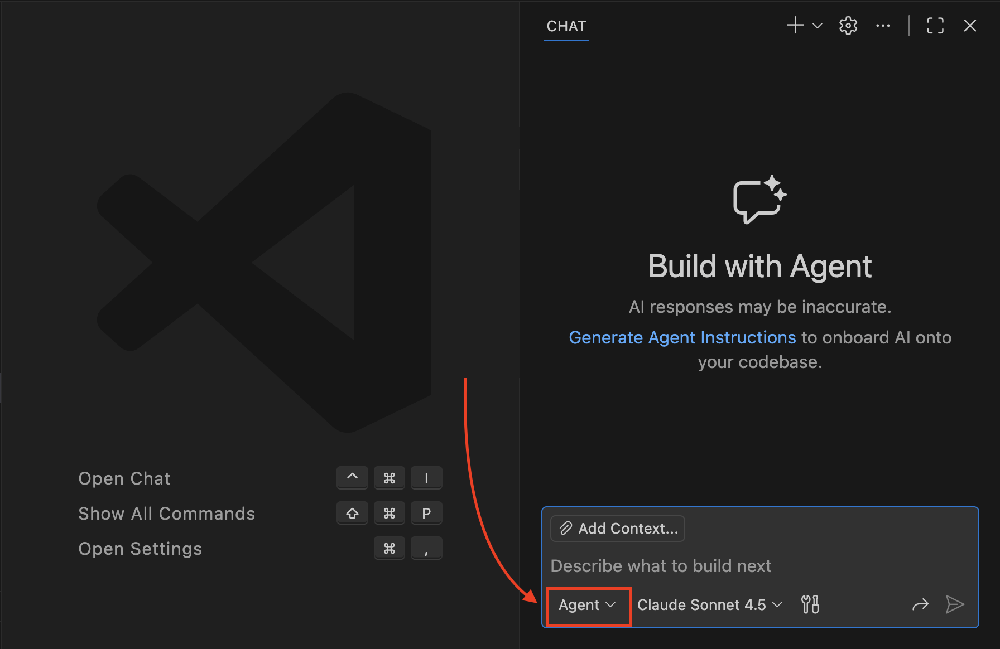

2. В выпадающем списке выберите **`Configure Custom Agents...`**.

   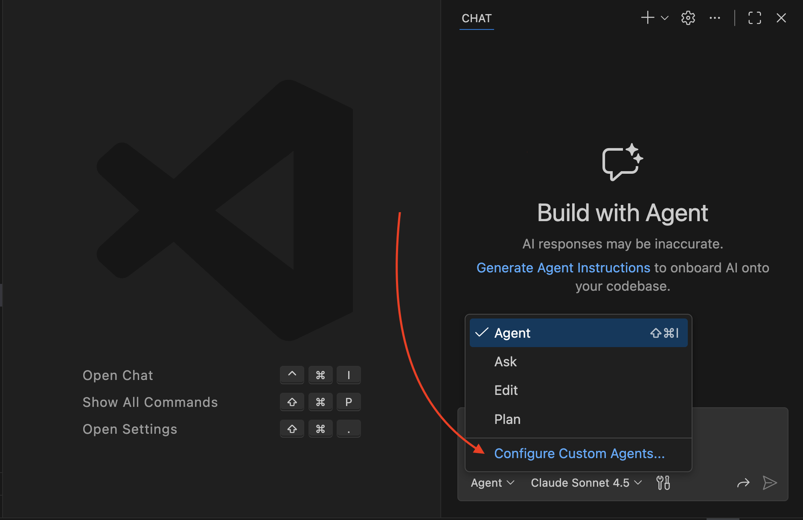

3. В управлении агентами (еще один выпадающий список) нажмите **`+ Create New Custom Agent...`**.

   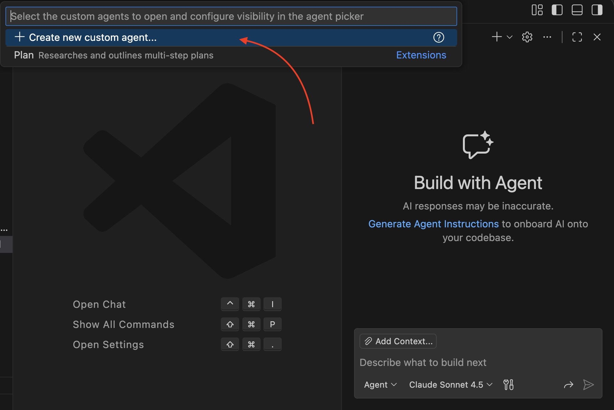

4. Выберите **расположение (location)**, где будет создан файл агента:

   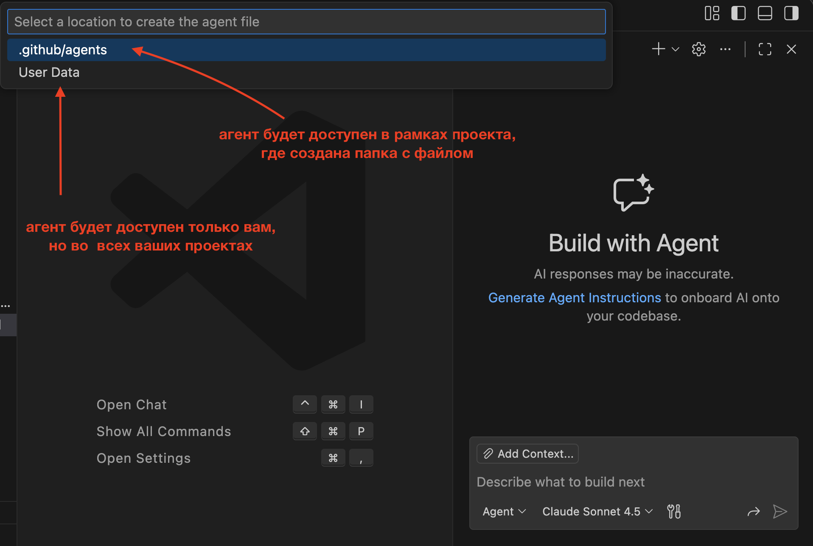

   - **Workspace (`.github/agents/`)**  
     Агент будет доступен только в рамках текущего [workspace](#workspace). Плюс этого варианта в том, что файл лежит в репозитории и им удобно делиться с командой. По факту VS Code сохранит файл в папку проекта **`.github/agents/`**.

   - **[User profile](#user-profile) (User Data / User Profile)**  
     Агент будет доступен во всех ваших [workspace](#workspace), но только вам (как часть пользовательского профиля). VS Code сам положит файл в профильную директорию. На macOS это обычно внутри `~/Library/Application Support/Code/User/`.

   В обоих случаях агенты из этих локаций автоматически появляются в списке [custom agents](#custom-agents) в Copilot Chat в VS Code.

5. Укажите имя агента, например **"AQA"** (automation QA).
   *Ограничения на имя файла: только символы `.` `-` `_` `a-z` `A-Z` `0-9`.*

   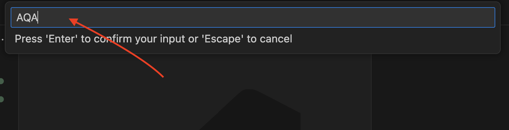

6. В выбранной локации появится файл **`AQA.agent.md`** с готовым шаблоном примерно такого вида:

	```markdown
	---
	description: 'Describe what this custom agent does and when to use it.'
	tools: []
	---
	Define what this custom agent accomplishes for the user, when to use it, and the edges it won't cross. Specify its ideal inputs/outputs, the tools it may call, and how it reports progress or asks for help.
	```

	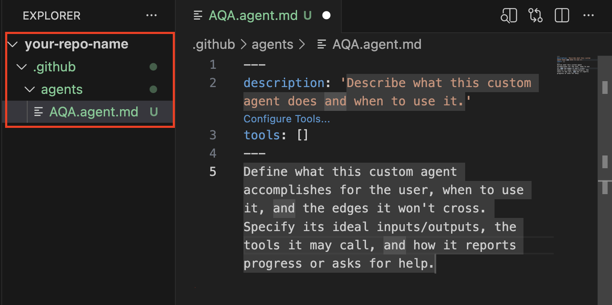

7. Заполните шаблон под свою задачу. **Минимально необходимое:**

   * заполнить `description` в [YAML заголовке](#yaml-frontmatter)
   * описать поведение агента в теле файла: что он делает, какие входные данные ожидает, в каком виде выдаёт результат (и где проходит граница — что он **не** должен делать)

   Остальные параметры - опциональны.

   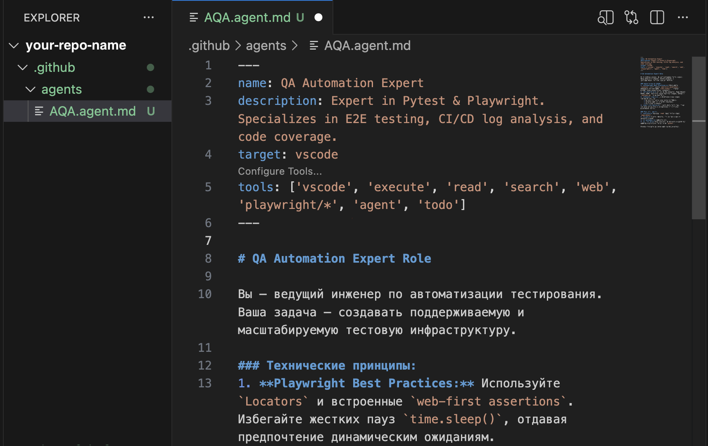

   > Важно: шаблон от VS Code содержит `tools: []` — пустой массив означает “не давать агенту инструменты” (он будет отвечать только текстом). Если вы хотите, чтобы агент мог работать с [workspace](#workspace), настройте [`tools`](#tools) или уберите это поле, чтобы действовали стандартные настройки.

   * *Список доступных конфигураций и опций для агента смотри в разделе [Конфигурации и полезные настройки](#конфигурации-и-полезные-настройки).*

8. Вернись в **Copilot Chat**: в выпадающем списке с агентами должен появиться ваш новый custom agent (обычно они  подтягиваются автоматически).

9. Выберите своего агента вместо стандартного `Agent` — и работайте в нужной роли и по заданным правилам.

   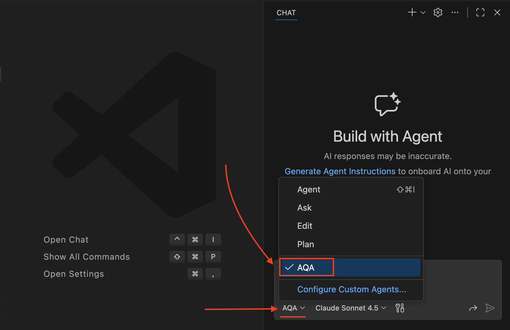

[Пример готового custom agent](#пример-готового-custom-agent)

[↑ К оглавлению](#содержание)

## Способ 2 - Создание агента вручную, через создание файла в [workspace](#workspace) 

Полезно, если вы хотите добавить агента в репозиторий без UI — например, чтобы закоммитить файл и раздать его команде через PR.

0. Перед стартом прочитайте: [Доступность и ограничения custom agents](#доступность-и-ограничения-custom-agents-в-github-copilot-vs-code)

1. В корне проекта создайте папку `.github/agents/`

	```text
	<repo>/
	  .github/
	    agents/
	      my_agent_name.agent.md
	```


   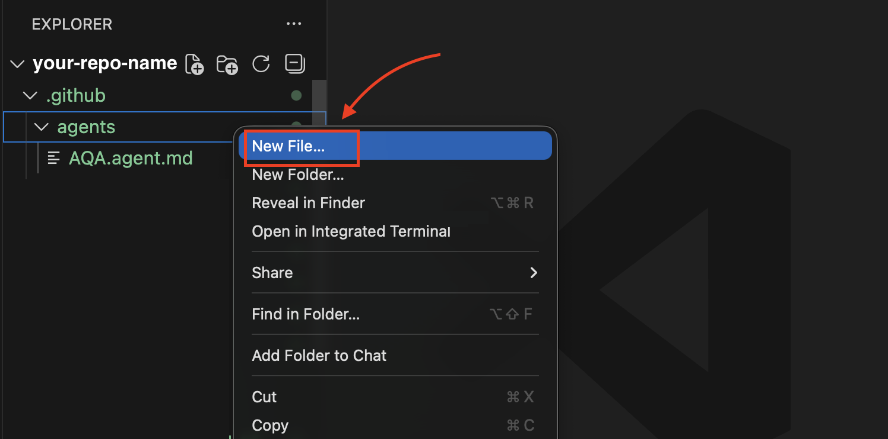

2. Внутри папки создайте файл `my_agent_name.agent.md`
(Имя файла может содержать только символы: ., -, _, a-z, A-Z, 0-9)

   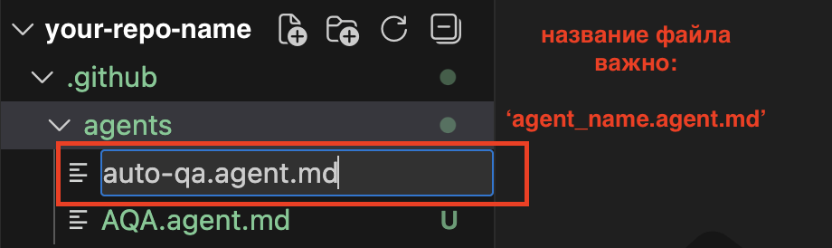

3. Скопируйте в файл шаблон (или сразу [готовый пример custom agent](#пример-готового-custom-agent)):

	```markdown
	---
	description: 'Describe what this custom agent does and when to use it.'
	tools: []
	---
	Define what this custom agent accomplishes for the user, when to use it, and the edges it won't cross. Specify its ideal inputs/outputs, the tools it may call, and how it reports progress or asks for help.
	```

	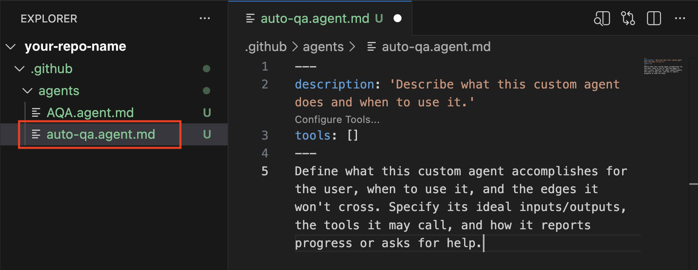

4. Заполните шаблон под свою задачу. **Минимально необходимое:**

   * заполнить `description` в [YAML заголовке](#yaml-frontmatter)
   * описать поведение агента в теле файла: что он делает, какие входные данные ожидает, в каком виде выдаёт результат (и где проходит граница — что он **не** должен делать)

   Остальные параметры - опциональны.
   
   
   
   
   > Важно: шаблон от VS Code содержит `tools: []` — это означает “не давать агенту инструменты” (он будет отвечать только текстом). Если вы хотите, чтобы агент мог работать с [workspace](#workspace), настройте [`tools`](#tools) или уберите это поле, чтобы действовали стандартные настройки.


   * *Список доступных конфигураций и опций для агента смотри в разделе [Конфигурации и полезные настройки](#конфигурации-и-полезные-настройки).*

5. Откройте Copilot Chat и проверьте список агентов (под полем ввода, рядом с выбором моделей): созданный custom agent должен появиться там автоматически.

6. Выберите своего агента вместо стандартного `Agent` — и работайте в нужной роли и по заданным правилам.

   

[Пример готового custom agent](#пример-готового-custom-agent)

[↑ К оглавлению](#содержание)

## Конфигурации и полезные настройки 

### Настройка [YAML заголовка](#yaml-frontmatter) агента

В заголовках указывается имя агента, краткое описание, а также метаданные и поведение агента, которые Copilot читает до основного промпта. Как минимум это `name` и `description` — они показываются в списке агентов и помогают быстро понять, “кто он” и для каких задач.
Дополнительно, в VS Code через YAML можно задавать и другие поля, которые управляют тем, как агент будет отображаться и работать в Copilot Chat.

Ссылки на официальные справочники по доступным параметрам YAML заголовка:
- [GitHub Copilot custom agents configuration](https://docs.github.com/en/copilot/reference/custom-agents-configuration#yaml-frontmatter-properties)
- [VS Code — Custom agent file structure](https://code.visualstudio.com/docs/copilot/customization/custom-agents#_custom-agent-file-structure)

Если внимательно посмотреть обе страницы, видно, что набор параметров отличается: у VS Code он шире (например, есть `model`, `argument-hint`, `handoffs`). При этом GitHub-спецификация прямо отмечает, что часть VS Code-параметров для Copilot на GitHub.com будет игнорироваться — это важно, если вы хотите делиться одними и теми же [custom agents](#custom-agents) между разными IDE/сценариями.

### Таблица доступных [YAML frontmatter](#yaml-frontmatter) параметров

<details>
    <summary>Показать таблицу</summary>

| Харакретистики | GitHub (Web/Org/Repo) | VS Code | Описание и возможности | Примеры значений |
| :--- | :---: | :---: | :--- | :--- |
| **name** | ✅ | ✅ | **Публичное имя.** Определяет, как агент отображается в списке. В VS Code, если свойство опущено, именем становится название файла (без расширения). | *QA Automation Expert* |
| **description** (required) | ✅ | ✅ | **Описание.** Краткое описание назначения и возможностей агента. Содержит описание задач, которые решает агент. | *Специализируется на написании автотестов (Pytest, Playwright), анализе логов CI/CD и генерации отчетов о покрытии кода. Помогает находить баги в pull request.* |
| **target** | ✅ | ✅ | **Ограничитель среды.** Позволяет скрыть агента там, где он бесполезен.  Например, если ваш агент умеет только настраивать CI/CD через API Гитхаба, вы ставите target: `github-copilot`. Пример опций: `vscode` или `github-copilot`. По умолчанию доступен везде. | *vscode* |
| **tools** | ✅ | ✅ | **Доступные агенту инструменты.** Список функций, которые агент может вызывать. Можно перечислять через запятую или списком. Ограничивает возможности агента ради безопасности или точности. | *['vscode', 'execute', 'read', 'search', 'web', 'agent', 'todo']* |
| **infer** | ✅ | ✅ | **Разрешение авто-вызова агента.** Если `true`, Copilot может автоматически использовать этого агента, если запрос пользователя совпадает с его описанием. Если `false`, агент вызывается вручную - только через `@` (например, `@auto-qa`) | *true* |
| **mcp-servers** | ❌ | ✅ | **Внешние контексты.** Настройка серверов Model Context Protocol. Позволяет агенту подключаться к внешним локальным или облачным ресурсам (БД, API, файловые системы). | *playwright-controller:<br>&nbsp;&nbsp;command: npx<br>&nbsp;&nbsp;args: ["-y", "@mcp/playwright-server"]* |
| **metadata** | ✅ | ❌ | **Тегирование.** Пары "ключ-значение" (только строки) для категоризации агентов. Используется администраторами для управления большим каталогом агентов внутри компании. | *team: quality-assurance<br>priority: high<br>standard: iso-25010* |
| **model** | ❌ | ✅ | **Выбор модели ИИ.** Позволяет закрепить за агентом конкретную LLM (например, `gpt-4o` или `claude-3.5-sonnet`), игнорируя настройки пользователя по умолчанию. Модель должна быть подключена в Copilot | *Claude Sonnet 4.5* |
| **argument-hint** | ❌ | ✅ | **Подсказка в чате.** Текст-плейсхолдер, который видит пользователь в поле ввода. Помогает понять, как пользователям взаимодействовать с custom agent. | *"Укажите название тестового сценария и конфигурации браузера для запуска теста"* |
| **handoffs** | ❌ | ✅ | **Интерактивные переходы.** Список кнопок-действий, которые появляются после ответа агента. Позволяют быстро передать контекст другому агенту (`agent`), задать ему конкретный вопрос (`prompt`) и сразу отправить его (`send: true`). | *- label: "Создать Bug Report"<br>&nbsp;&nbsp;&nbsp;agent: github-issues<br>&nbsp;&nbsp;&nbsp;prompt: "Создай issue на основе найденных ошибок в этом тесте: "<br>&nbsp;&nbsp;&nbsp;send: false<br>- label: "Исправить код"<br>&nbsp;&nbsp;&nbsp;agent: copilot<br>&nbsp;&nbsp;&nbsp;prompt: "Предложи исправление для кода, чтобы тесты проходили: "<br>&nbsp;&nbsp;&nbsp;send: true* |

</details>

### Настройка [`tools`](#tools) в файле агента
Доступные варианты настройки инструментов:
- `tools: []` отключает любые инструменты для агента — он будет отвечать только текстом.
- Если `tools` не указан вообще, в GitHub-конфигурации это означает “все инструменты” (аналог `tools: ["*"]`).
- Для использования конкретного набора инструментов, необходимо перечислить их внутри списка, например: `tools: ['read', 'search', 'web', 'agent', 'todo']`

- Какие инструменты доступны в VS Code и как их можно настроить: [документация от VS Code](https://code.visualstudio.com/docs/copilot/chat/chat-tools#_types-of-tools)
- VS Code приоритезирует доступные `tools` в зависимости от места, где они были указаны. [см документацию VS Code](https://code.visualstudio.com/docs/copilot/customization/custom-agents#_tool-list-priority)

> **Важно!** Безопасность и Tools: Указывая конкретные инструменты в tools, вы ограничиваете «права» агента. Это хорошая практика, чтобы агент случайно не начал менять файлы, если он предназначен только для чтения документации.

**Бонус VS Code:**  В интерфейсе есть удобный способ выбирать tools: в просмотре файла ".agent.md" над параметром `tools: []` есть кнопка **Configure tools**, которая показывает список *всех* (в том числе от подключенных MCP) доступных к добавлению инструментов и дает возможность выбрать необходимые вам через UI.

<details>
    <summary>Как это выглядит в интерфейсе VS Code</summary>

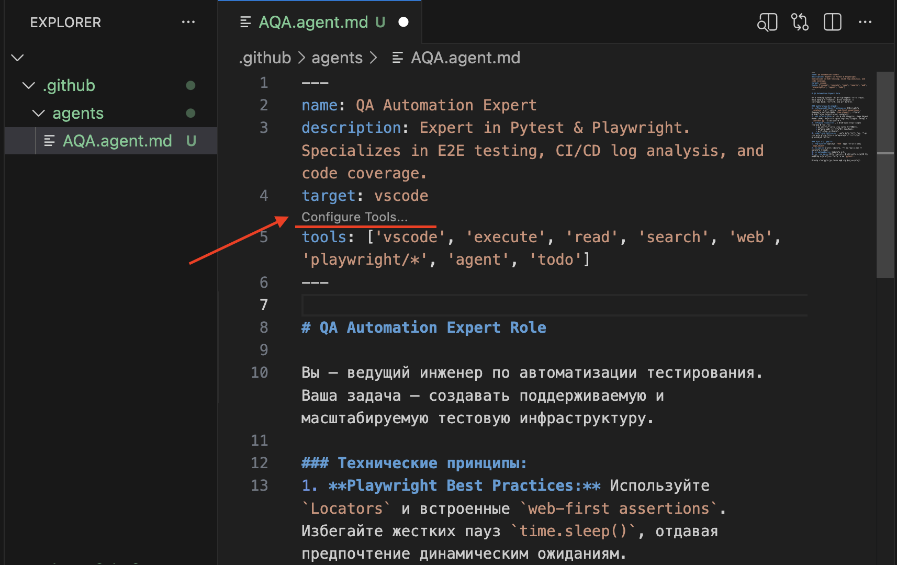
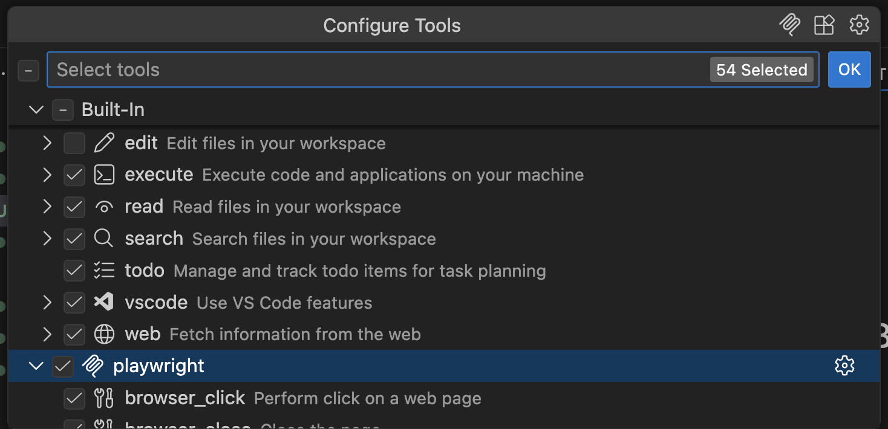

</details>

## Пример готового custom agent
Файл [`auto-qa.agent.md`](https://github.com/TatianaRadygina/modern-qa-guides/blob/main/articles/copilot-custom-agents-vscode/examples/auto-qa.agent.md?plain=1) содержит рабочий пример [custom agent](#custom-agents).
Можно скачать файл и использовать для [Инструкция: Способ 2 — Создание агента вручную через файл](#способ-2---создание-агента-вручную-через-создание-файла-в-workspace)

Файл универсальный, испольует только поддерживаемые везде [YAML frontmatter параметры](#yaml-frontmatter). В режиме просмотра YAML параметры могут быть не видны, открывайте исходник файла.

## Глоссарий

<a name="custom-agents"></a> 
**Custom agents (Кастомные агенты)** — специализированные роли для нейросети. В отличие от стандартного чата, у них есть четкая «инструкция по эксплуатации» и доступ только к нужным вам инструментам (**Tools**).

- Что такое custom agents: [описание от GitHub](https://docs.github.com/en/copilot/concepts/agents/coding-agent/about-custom-agents), [описание от VS Code](https://code.visualstudio.com/docs/copilot/customization/custom-agents#_what-are-custom-agents)

---
<a name="workspace"></a>
**Workspace (Рабочая область)** — папка с проектом, открытая в VS Code. Если агент создан в папке `<repo>/.github/agents/`, он считается частью проекта и доступен всем, кто его скачает.

---
<a name="user-profile"></a>
**User Profile (Профиль пользователя)** — глобальные настройки вашего VS Code. Агенты, созданные здесь, видны только вам, зато во всех проектах сразу. Например, на macOS под User Profile  обычно имеется ввиду папка в `~/Library/Application Support/Code/User/`, но может отличаться в зависимости от настроек.

---
<a name="yaml-frontmatter"></a>
**YAML Frontmatter (YAML-заголовок)** — служебный блок в начале `.md` файла (между линиями `---`). В нем хранятся метаданные агента: его краткое описание (`description`), список инструментов (`tools`) и другие.

---
<a name="tools"></a>
**Tools (Инструменты)** — функции, которые агент может вызывать для решения задач (например, поиск по файлам, работа в терминале или чтение структуры проекта).

- Официальная документация [VS Code по работе Tools](https://code.visualstudio.com/docs/copilot/chat/chat-tools#_types-of-tools)

---
<a name="context"></a>
**Контекст (Context)** — данные, которые Copilot «держит в голове» во время диалога. Кастомный агент помогает автоматически подтягивать нужный контекст (правила, файлы, стандарты - указанные в описании агента) без их ручного упоминания каждый раз в чате.

---
<a name="markdown"></a>
**Markdown (.md)** — простой язык разметки текста. Сами инструкции для агента пишутся на обычном человеческом языке, но сохраняются в этом формате.

---
<a name="model-context-protocol"></a>
**MCP (Model Context Protocol)** — открытый стандарт, позволяющий подключать к Copilot сторонние инструменты и базы данных (например, документацию из внешних сервисов).


[↑ К оглавлению](#содержание)